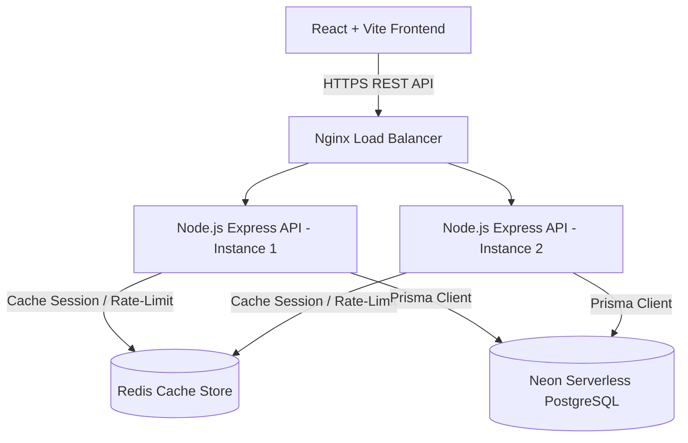

# TradeLedger Pro – Secure Trade Analytics Platform

TradeLedger Pro is a production-ready, highly secure SaaS web application designed for active financial traders to record, manage, analyze, and monitor their trades across **Cryptocurrency, Stocks, Forex, and Commodities**. 

This repository showcases advanced full-stack engineering, secure credential management (JWT access/refresh token rotation), structured logging, containerized environment setups, and data visualizers tailored for recruiter review.

---

## 🏗️ System Architecture & Diagram

TradeLedger Pro uses a decoupled client-server model built to scale horizontally:



- **Frontend (Client)**: React.js SPA initialized using Vite. Styled with Tailwind CSS (featuring a dark theme modeled after Stripe and TradingView dashboards). Uses Recharts for real-time charting and equity curve mapping.
- **Backend (API)**: Node.js Express server utilizing the Controller-Service-Repository pattern. Decoupled database operations ensure business logic and HTTP interfaces remain separate.
- **ORM & Database**: Connected to **Neon Serverless PostgreSQL** via **Prisma ORM**. Decimal parameters represent price assets accurately, preventing precision errors.
- **Security & Logging**: Integrates Helmet security headers, CORS policies, rate limiting, and dual JWT authorization models (15-minute access expiration + 7-day database-backed refresh tokens). Winston & Morgan handle log parsing.
- **Orchestration**: Fully dockerized locally using Docker Compose, spinning up isolated PostgreSQL database boxes and Node.js servers automatically.

---

## 🛠️ Tech Stack & Packages

### Backend
- **Node.js & Express.js** - Server framework.
- **Prisma ORM** - Type-safe schema generator and query client.
- **PostgreSQL (Neon)** - Serverless relational storage.
- **bcryptjs** - 10-rounds salt hashing for credential safety.
- **jsonwebtoken** - Signed access & refresh tokens.
- **winston & morgan** - Structured file logging and request streams.
- **express-validator** - Input validation & sanitization.
- **swagger-ui-express & swagger-jsdoc** - OpenAPI spec generator.

### Frontend
- **React.js (Vite)** - Build tool and layout component engine.
- **React Router v6** - Route guards and redirection layers.
- **Axios** - Network client with automated JWT refresh interceptors.
- **Recharts** - Responsive charts (Equity lines, category pies).
- **Tailwind CSS** - Modern dark-mode custom theme styling.
- **react-hot-toast** - Interactive user notification popups.
- **lucide-react** - Icon set.

---

## 🔑 Security & Token Rotation Flow

To guarantee enterprise-level auth security, TradeLedger Pro implements **Automatic Refresh Token Rotation**:

1. **Authentication**: User logs in -> Server generates a signed Access Token (`15m` expiry) and a cryptographically unique Refresh Token (`7d` expiry).
2. **Persistence**: The Refresh Token is stored in a relational `refresh_tokens` table mapped to the user ID.
3. **API Access**: The client adds the Access Token inside the `Authorization: Bearer <token>` header of every outgoing Axios request.
4. **Token Expiry**: When the Access Token expires:
   - The React Axios Interceptor catches the `401 Unauthorized` response.
   - It pauses the request queue, sends a POST to `/auth/refresh` with the stored Refresh Token.
   - The server validates the Refresh Token in the database, deletes it (rotation), generates a **new** Access/Refresh token pair, and writes the new refresh token to the DB.
   - The client updates local storage, updates its headers, and retries the failed requests seamlessly without logging the user out.
5. **Revocation**: If a token is reused or if the user logs out, the refresh token is instantly deleted from the database, blocking all future session extensions.

---

## 🗄️ Database Schema & Prisma Config

Prisma ORM handles migrations, enums, relationship checks, and composite index configurations automatically. The schema is stored in `backend/prisma/schema.prisma`:

```prisma
datasource db {
  provider  = "postgresql"
  url       = env("DATABASE_URL")
  directUrl = env("DIRECT_URL")
}

generator client {
  provider = "prisma-client-js"
}

enum Role {
  user
  admin
}

enum AssetCategory {
  CRYPTO
  STOCK
  FOREX
  COMMODITY
}

enum TradeType {
  BUY
  SELL
}

enum TradeStatus {
  OPEN
  CLOSED
}

model User {
  id            Int            @id @default(autoincrement())
  name          String
  email         String         @unique
  password      String
  role          Role           @default(user)
  createdAt     DateTime       @default(now()) @map("created_at")
  updatedAt     DateTime       @updatedAt @map("updated_at")
  trades        Trade[]
  refreshTokens RefreshToken[]

  @@map("users")
}

model RefreshToken {
  id        Int      @id @default(autoincrement())
  token     String   @unique
  userId    Int      @map("user_id")
  user      User     @relation(fields: [userId], references: [id], onDelete: Cascade)
  expiresAt DateTime @map("expires_at")
  createdAt DateTime @default(now()) @map("created_at")

  @@map("refresh_tokens")
}

model Trade {
  id            Int           @id @default(autoincrement())
  assetName     String        @map("asset_name") @db.VarChar(50)
  assetCategory AssetCategory @map("asset_category")
  exchange      String?       @db.VarChar(100)
  tradeType     TradeType     @map("trade_type")
  status        TradeStatus   @default(CLOSED)
  entryPrice    Decimal       @map("entry_price") @db.Decimal(18, 8)
  exitPrice     Decimal       @default(0) @map("exit_price") @db.Decimal(18, 8)
  quantity      Decimal       @db.Decimal(18, 8)
  profitLoss    Decimal       @default(0) @map("profit_loss") @db.Decimal(18, 8)
  tradeDate     DateTime      @default(now()) @map("trade_date")
  notes         String?       @db.Text
  userId        Int           @map("user_id")
  user          User          @relation(fields: [userId], references: [id], onDelete: Cascade)
  createdAt     DateTime      @default(now()) @map("created_at")
  updatedAt     DateTime      @updatedAt @map("updated_at")

  @@index([userId, tradeDate])
  @@index([assetName])
  @@index([assetCategory])
  @@map("trades")
}
```

### ⚡ Optimization & Indexing Strategies:
- **`@@index([userId, tradeDate])` (Composite Index)**: Speeds up filtered dashboard analytics and chronological page fetches queries which query `WHERE user_id = ? ORDER BY trade_date DESC`.
- **`@@index([assetName])`**: Optimizes search lookups matching specific tickers (e.g. `WHERE asset_name LIKE 'BTC%'`).
- **`@@index([assetCategory])`**: Optimizes category groupings on widgets and pie charts.

---

## 📈 Scalability, DevOps & Production Best Practices

To handle system scaling in production, the following practices are recommended:

1. **Horizontal Scaling & Load Balancing**:
   - Use an **Nginx** or **AWS ALB (Application Load Balancer)** in round-robin mode to distribute incoming HTTP requests among multiple API container instances.
   - Run the Node server state-free. Centralize session state verification utilizing Redis or self-contained JWT.
2. **Redis Caching**:
   - Store highly-queried analytical metrics (such as `winRate`, `netProfit`, `bestAsset`) in a Redis cache.
   - Invalidate or refresh the cache whenever a user creates, updates, or deletes a trade.
   - Implement Redis for API rate limiting to keep tracking states clean across cluster endpoints.
3. **Database Scaling & Neon Features**:
   - **Connection Pooling**: Neon provides a built-in PgBouncer pooler. The application connects to it via the pooled `DATABASE_URL` (using `-pooler.neon.tech`), while running direct migrations via `DIRECT_URL`. This guarantees the serverless application does not saturate DB connection limits.
   - **Database Branching**: Run developer branching models via Neon's console command hooks. Staging database branches copy schema templates instantly, enabling zero-impact schema changes.
4. **CI/CD Pipelines**:
   - Establish GitHub Actions to run test suites on push events.
   - Trigger Docker builds automatically upon validation and publish to registries like Amazon ECR.
   - Deploy updates to Render/Vercel or orchestrators like Kubernetes/ECS via blue-green deployments to avoid system downtime.

---

## 🚀 Setup & Installation Guide

Follow these steps to run TradeLedger Pro locally:

### Prerequisites
- Node.js (v18+)
- PostgreSQL Database (v15+) or Docker Desktop

---

### Method A: Running with Docker Compose (Recommended)
This runs the database and backend automatically in unified networking containers:

1. Clone this repository to your computer.
2. Open a terminal in the root workspace and run:
   ```bash
   docker-compose up --build
   ```
3. Docker will spin up the PostgreSQL container, compile the Prisma client, push database schemas, and start the backend API at `http://localhost:5000`.
4. Run the frontend locally (see Frontend setup below).

---

### Method B: Manual Local Run

#### 1. Database Setup
- Start your local PostgreSQL instance and create a database called `tradeledger_db`.

#### 2. Backend API Setup
1. Navigate to `/backend`.
2. Copy `.env.example` to `.env` and fill in your connection details (both `DATABASE_URL` and `DIRECT_URL`):
   ```bash
   cp .env.example .env
   ```
3. Install dependencies:
   ```bash
   npm install
   ```
4. Push the Prisma schema directly to provision tables in the database:
   ```bash
   npx prisma db push
   ```
5. Generate the local Prisma Client client:
   ```bash
   npx prisma generate
   ```
6. Start the development server (auto-rebuilds via nodemon):
   ```bash
   npm run dev
   ```
7. Confirm server started successfully at `http://localhost:5000` and displays API endpoints.

#### 3. Frontend Client Setup
1. Navigate to `/frontend`.
2. Install dependencies:
   ```bash
   npm install
   ```
3. Start the Vite React development server:
   ```bash
   npm run dev
   ```
4. Open your browser and navigate to `http://localhost:5173`.

---

## 🧪 Verification & API Testing

- **API Documentation**: Visit `http://localhost:5000/api-docs` to view the interactive Swagger OpenAPI UI, allowing you to test login credentials, token refresh cycles, and trade logging fields.
- **Admin Dashboard Bypass**: To verify administrative metrics and global user control boards, change the `role` enum of any registered user from `user` to `admin` in your database users table.
